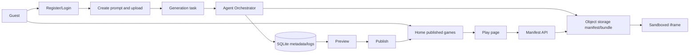

# System Design

## Goal

Build an AI Native interactive game web platform MVP that demonstrates both product workflow and engineering boundaries. The system supports two primary journeys: players discover and play published games, while creators generate and publish games through an Agent workflow.

## Components

- Frontend SPA: Home, Auth, Create, Tasks, Play, Docs.
- HTTP API: Auth, games, manifests, uploads, generation tasks, publish.
- SQLite database: users, sessions, games, versions, tasks, logs, assets, audit events.
- Agent Orchestrator: deterministic local harness that simulates an extensible multi-step generation chain.
- Object storage adapter: local filesystem implementation with key normalization and root containment.
- Play runtime: manifest-driven loader that mounts bundles inside sandboxed iframes.

## Request Flow

## Boundaries

- Frontend never hardcodes the game list as source of truth. It reads `/api/games`.
- Play never imports a local game component. It reads `/api/games/:id/manifest`, validates the manifest entry, then loads `/objects/...`.
- Generated artifacts are portable HTML bundles. They can move to S3/OSS because only object keys and URLs are stored.
- Agent logs are persisted, not only printed to console.
- OAuth is a demo callback in this MVP but has a real `oauth_accounts` schema and provider boundary.

## Failure Handling

- API errors return structured JSON with HTTP status.
- Uploads enforce size and MIME family limits.
- Task failures update task status and write error logs.
- Play shows loading, loaded, failed, and idle states.
- Manifest access checks publication or ownership.

## Production Upgrade Path

- Replace `LocalObjectStorage` with S3/OSS-compatible adapter.
- Replace local Agent harness with model/tool orchestration.
- Add optional Godot MCP adapter as a secondary generator/export path while keeping HTML Canvas bundles as the default zero-install runtime.
- Add a realtime game server tier for larger online games and dungeon/instance games:
  - Gateway: WebSocket or WebTransport entrypoint with auth, rate limiting, heartbeat, and reconnect tokens.
  - Matchmaking/room service: creates rooms, parties, and dungeon instance assignments.
  - Instance workers: run authoritative simulation for each dungeon copy, persist checkpoints, and stream state deltas to clients.
  - Persistence: Postgres for account/character/inventory/progression, Redis for presence/session routing, and object storage/CDN for generated assets.
  - Operations: horizontal worker scaling, shard/region routing, replay/debug traces, metrics, and anti-cheat validation on the server.
- Add job queue durability using Redis/BullMQ or database polling.
- Add OAuth provider exchanges and CSRF state validation.
- Add Postgres migrations and row-level authorization tests.

## Extension Decision

Godot MCP is intentionally not part of the current default runtime. The platform is web-native and manifest-driven, so the reliable path is prompt -> Agent task -> generated HTML bundle -> object storage -> sandboxed Play iframe. A future Godot adapter can sit behind the same Agent and object-storage contracts, but it should remain optional because it adds Godot installation, export-template, WebAssembly/WebGL, and hosting-header requirements. See `docs/godot-mcp-extension.md`.
